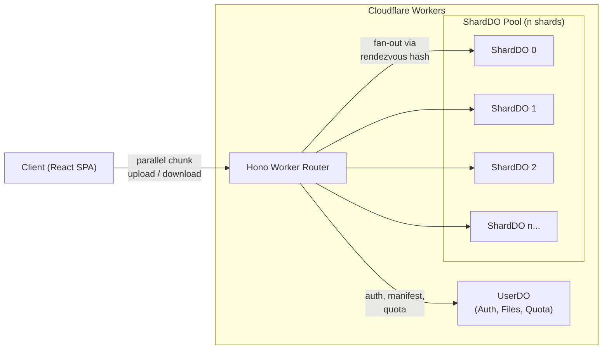

# Mossaic

**Distributed file storage powered by Cloudflare Durable Objects.** &nbsp;·&nbsp; [**Live Demo →**](https://mossaic.ashishkumarsingh.com)

Mossaic splits every file into 1 MB chunks, hashes them with SHA-256, distributes them across a dynamic pool of Durable Object shards via rendezvous hashing, and transfers them in parallel. The result is a fast, deduplicated, horizontally-scaling storage system that runs entirely on the Cloudflare edge — no origin servers, no S3 buckets, no external databases.

---

## Architecture



Each user gets their own **UserDO** (auth, file manifests, folder hierarchy, quota tracking) and a **dynamic pool of ShardDOs** that store the actual chunk data. Chunks are placed deterministically — both client and server can independently compute which shard holds any chunk with zero coordination.

---

## Features

- **Chunked parallel uploads & downloads** — files are split into 1 MB chunks and transferred with up to 6 concurrent streams, with exponential-backoff retry and real-time throughput/ETA tracking
- **Content-addressed deduplication** — every chunk is SHA-256 hashed; duplicate chunks are reference-counted, never stored twice
- **Rendezvous hashing placement** — deterministic, coordination-free chunk-to-shard mapping via MurmurHash3; adding shards causes minimal redistribution
- **Dynamic shard pool** — starts at 32 shards per user, grows by 1 shard for every 5 GB stored
- **JWT authentication** — PBKDF2-hashed passwords (100k iterations), HS256 JWTs via `jose`, 30-day sessions
- **File manager** — drag-and-drop uploads, nested folder hierarchy, breadcrumb navigation, search-param-driven routing
- **Photo gallery** — justified grid layout (Google Photos-style), full-screen lightbox with zoom/pan/swipe, keyboard navigation, filmstrip scrubber
- **Albums & sharing** — client-side album management, public shared album links via base64-encoded tokens
- **Analytics dashboard** — storage quota, file status breakdown, MIME distribution, per-shard chunk/dedup stats, recent uploads
- **Dark & light themes** — CSS custom property theming with Tailwind v4, persisted to localStorage

---

## How It Works

### Chunking

Every file is split into fixed **1 MB (1,048,576 byte)** chunks. The last chunk may be smaller. Files under 1 MB are a single chunk. This is computed identically on both client and server via `shared/chunking.ts`.

### Placement via Rendezvous Hashing

For each chunk, Mossaic computes a [rendezvous hash](https://en.wikipedia.org/wiki/Rendezvous_hashing) (highest random weight) score against every shard in the user's pool:

```
score = murmurhash3("{fileId}:{chunkIndex}:shard:{userId}:{shardIndex}")
```

The shard with the **highest score** wins. This is:
- **Deterministic** — the same inputs always produce the same placement, no coordination needed
- **Minimal disruption** — when the pool grows, only ~1/n chunks need to move
- **Uniform** — MurmurHash3 distributes chunks evenly across shards

The placement logic lives in `shared/placement.ts` and is imported by both the frontend and the worker.

### Parallel Transfer

**Upload flow:**
1. `POST /api/upload/init` — server creates a file record, returns chunk layout and pool size
2. Client slices the file, SHA-256 hashes each chunk, and uploads up to 6 chunks concurrently via `PUT /api/upload/chunk/:fileId/:chunkIndex`
3. The worker computes the target shard via rendezvous hashing and forwards the chunk to the correct ShardDO
4. ShardDO performs content-addressed dedup: if the hash already exists, it increments ref_count (zero bytes stored); otherwise it inserts the BLOB
5. `POST /api/upload/complete/:fileId` — client sends the file hash (SHA-256 of all chunk hashes), server marks the file complete

**Download flow:**
1. `GET /api/download/manifest/:fileId` — returns the full chunk list with shard locations
2. Client downloads up to 6 chunks concurrently via `GET /api/download/chunk/:fileId/:chunkIndex`
3. Chunks are reassembled in order and delivered as a browser download

---

## Tech Stack

| Layer | Technology |
|---|---|
| **Runtime** | [Cloudflare Workers](https://workers.cloudflare.com/) |
| **State** | [Durable Objects](https://developers.cloudflare.com/durable-objects/) with SQLite storage |
| **Routing** | [Hono](https://hono.dev/) |
| **Auth** | [jose](https://github.com/panva/jose) (JWT), PBKDF2-SHA-256 (passwords) |
| **Frontend** | [React 19](https://react.dev/) + [React Router v7](https://reactrouter.com/) |
| **Build** | [Vite](https://vite.dev/) + [@cloudflare/vite-plugin](https://github.com/cloudflare/workers-sdk) |
| **Styling** | [Tailwind CSS v4](https://tailwindcss.com/) + [Radix UI](https://www.radix-ui.com/) primitives |
| **Animation** | [Framer Motion](https://www.framer.com/motion/) |
| **Icons** | [Lucide React](https://lucide.dev/) |
| **Package manager** | [pnpm](https://pnpm.io/) |

---

## Project Structure

```
mossaic/
├── shared/                     # Shared library (imported by frontend + worker)
│   ├── types.ts                #   All TypeScript types and interfaces
│   ├── constants.ts            #   Chunk size, pool config, limits, concurrency
│   ├── chunking.ts             #   Fixed 1 MB chunk splitting logic
│   ├── placement.ts            #   Rendezvous hashing (chunk → shard mapping)
│   ├── hash.ts                 #   MurmurHash3 (32-bit, for placement)
│   └── crypto.ts               #   SHA-256 chunk/file hashing (Web Crypto API)
│
├── worker/                     # Cloudflare Worker backend
│   ├── index.ts                #   Hono app, CORS, DO re-exports, SPA fallback
│   ├── routes/
│   │   ├── auth.ts             #     POST /api/auth/signup, /login
│   │   ├── upload.ts           #     Upload init, chunk PUT, complete
│   │   ├── download.ts         #     Manifest GET, chunk streaming
│   │   ├── files.ts            #     File listing and deletion
│   │   ├── folders.ts          #     Folder CRUD
│   │   ├── analytics.ts        #     GET /api/analytics/overview
│   │   ├── gallery.ts          #     Photo listing, image/thumbnail serving
│   │   └── shared.ts           #     Public shared album endpoints
│   ├── objects/
│   │   ├── user/
│   │   │   ├── user-do.ts      #     UserDO class (auth, files, folders, quota)
│   │   │   ├── auth.ts         #     Signup/login handlers
│   │   │   ├── files.ts        #     File CRUD, manifest, chunk recording
│   │   │   ├── folders.ts      #     Folder CRUD, breadcrumb path
│   │   │   └── quota.ts        #     Storage quota, dynamic pool sizing
│   │   └── shard/
│   │       └── shard-do.ts     #     ShardDO class (chunk storage, dedup, refs)
│   └── lib/
│       ├── auth.ts             #     JWT sign/verify, auth middleware
│       ├── crypto.ts           #     PBKDF2 password hashing
│       └── utils.ts            #     ID generation, DO name helpers
│
├── src/                        # React SPA frontend
│   ├── app.tsx                 #   Root component, routing, providers
│   ├── main.tsx                #   Vite entry point
│   ├── index.css               #   Tailwind v4 theme tokens (dark/light)
│   ├── lib/
│   │   ├── api.ts              #     API client singleton
│   │   ├── auth.tsx            #     Auth context + useAuth hook
│   │   ├── theme.tsx           #     Dark/light theme provider
│   │   └── utils.ts            #     formatBytes, formatDate, cn(), etc.
│   ├── hooks/
│   │   ├── use-upload.ts       #     Parallel chunked upload engine
│   │   ├── use-download.ts     #     Parallel chunked download engine
│   │   ├── use-files.ts        #     File/folder listing hook
│   │   ├── use-gallery.ts      #     Photo gallery with date grouping
│   │   ├── use-albums.ts       #     Album CRUD (localStorage-backed)
│   │   ├── use-analytics.ts    #     Analytics data fetcher
│   │   └── use-image-loader.ts #     Auth-aware blob URL image loading
│   ├── pages/
│   │   ├── landing.tsx         #     Marketing landing page
│   │   ├── files.tsx           #     File manager page
│   │   └── analytics.tsx       #     Analytics dashboard
│   └── components/
│       ├── auth/               #     Login/signup form
│       ├── layout/             #     Sidebar, app shell
│       ├── files/              #     File rows, folder rows, breadcrumbs
│       ├── upload/             #     Drag-and-drop zone, transfer panel
│       ├── gallery/            #     Justified grid, thumbnails, lightbox
│       └── ui/                 #     Radix-based design system primitives
│
├── wrangler.jsonc              # Cloudflare config (DO bindings, migrations)
├── vite.config.ts              # Vite + Tailwind + Cloudflare plugin
├── package.json                # Dependencies and scripts
└── tsconfig.json               # TypeScript project references
```

---

## Getting Started

### Prerequisites

- [Node.js](https://nodejs.org/) (v18+)
- [pnpm](https://pnpm.io/)

### Install

```bash
pnpm install
```

### Develop

```bash
pnpm dev
```

This starts the Vite dev server with the Cloudflare plugin on `http://localhost:5174`. Durable Objects run locally via Miniflare — no Cloudflare account needed for development.

### Build

```bash
pnpm build
```

### Deploy

```bash
pnpm deploy
```

Builds the SPA and deploys the worker + assets to Cloudflare.

---

## Roadmap

- **Semantic search** — provider-agnostic vector search over stored files. Planned backend options:
  - [Cloudflare Vectorize](https://developers.cloudflare.com/vectorize/) + [Workers AI](https://developers.cloudflare.com/workers-ai/) for edge-native inference
  - [Ollama](https://ollama.ai/) for self-hosted local models
  - Pluggable local vector DB for offline/dev workflows
- **Shared albums enhancement** — server-side album storage, granular permissions, expiring share links
- **Resumable uploads** — persist upload state to recover from interruptions
- **Chunk-level integrity verification** — client-side hash verification on download
- **Storage tiering** — hot/cold chunk migration based on access patterns

---

## Build & Deploy

### Prerequisites

- [Node.js](https://nodejs.org/) v20+
- [pnpm](https://pnpm.io/)
- A [Cloudflare account](https://dash.cloudflare.com/sign-up) (free tier works)
- A custom domain on the same Cloudflare account, if you intend to serve from one (otherwise the default `*.workers.dev` subdomain is used)

### Local development

```bash
pnpm install
pnpm dev
```

Vite + the Cloudflare plugin run the worker, Durable Objects (via Miniflare), and the SPA together — no Cloudflare account needed for local work.

### Production build

```bash
pnpm build
```

Outputs the SPA assets and worker bundle that `wrangler deploy` will publish.

### Deploy to Cloudflare

```bash
npx wrangler login
```

Then open [`wrangler.jsonc`](wrangler.jsonc) and set:

- `account_id` — your Cloudflare account ID (visible in the dashboard sidebar)
- `routes` — the hostname(s) you want to serve from, e.g. `[{ "pattern": "mossaic.example.com", "custom_domain": true }]`. Omit `routes` to deploy to the default `*.workers.dev` subdomain.

Then ship it:

```bash
npx wrangler deploy
```

The first deploy provisions the Durable Object namespaces and applies the migrations declared in `wrangler.jsonc`.

---

## License

[MIT](LICENSE)
