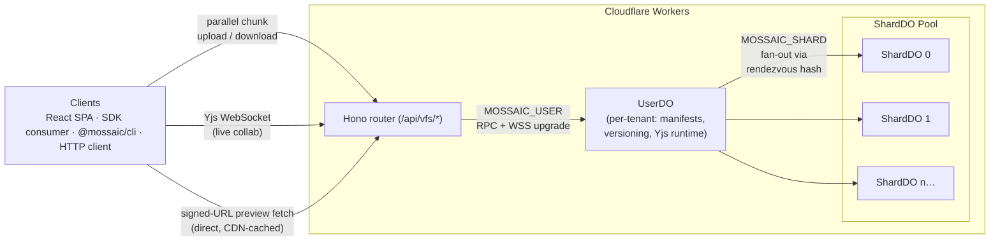
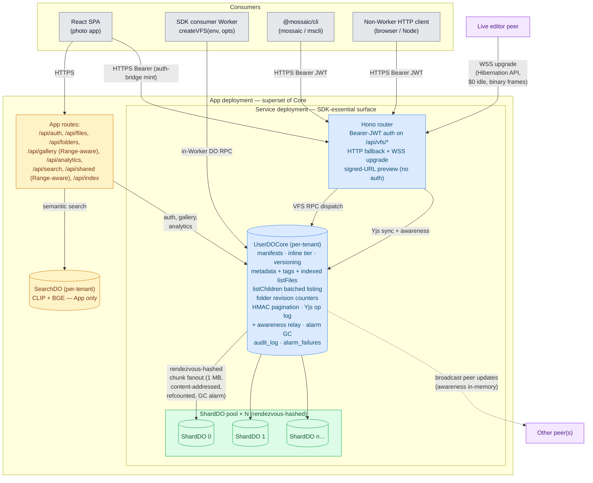

<div align="center">
  

  <p>
    <strong>A Node <code>fs/promises</code> filesystem on Cloudflare Durable Objects.</strong>
  </p>

  <p>
    <a href="https://mossaic.ashishkumarsingh.com">Live demo</a> &middot;
    <a href="./sdk/README.md"><code>@mossaic/sdk</code></a> &middot;
    <a href="./cli/README.md"><code>@mossaic/cli</code></a> &middot;
    <a href="./docs/integration-guide.md">Integration guide</a> &middot;
    <a href="./lean/">Lean proofs</a>
  </p>

  
</div>

---

## What is Mossaic?

A horizontally-scalable, content-addressed filesystem that runs entirely on Cloudflare's edge &mdash; no origin servers, no S3, no external databases. Files are split into 1 MB chunks, SHA-256 hashed, distributed across a dynamic pool of Durable Object shards via rendezvous hashing, and transferred in parallel.

Use it for photo libraries, ML datasets, build artifacts, isomorphic-git filesystem layers, attachments, container layers, or **live collaborative documents** (per-file Yjs CRDT mode at $0 idle billing). Critical correctness invariants are formally proved in **Lean 4 with Mathlib** &mdash; **226 theorems, 0 axioms, 0 sorrys**.

The repo ships **two products**: a runnable photo-library SPA and a reusable npm SDK. They share the same Durable-Object backend, the same chunking and placement primitives, and the same canonical `/api/vfs/*` HTTP surface.

---

## Quick start &mdash; SDK

```bash
pnpm add @mossaic/sdk
```

```ts
import { UserDO, ShardDO, createVFS } from "@mossaic/sdk";

// wrangler discovers DO classes from the Worker's main-module exports.
export { UserDO, ShardDO };

export interface Env {
  MOSSAIC_USER:  DurableObjectNamespace<UserDO>;
  MOSSAIC_SHARD: DurableObjectNamespace<ShardDO>;
}

export default {
  async fetch(_req: Request, env: Env) {
    const vfs = createVFS(env, { tenant: "acme-corp" });
    await vfs.writeFile("/hello.txt", "world");
    return new Response(await vfs.readFile("/hello.txt", { encoding: "utf8" }));
  },
};
```

That's the entire integration. Multi-tenant via `vfs:${ns}:${tenant}[:${sub}]` DO naming, one outbound DO RPC per VFS call, isomorphic-git plugs in directly via `vfs.promises === vfs`. See **[`sdk/README.md`](./sdk/README.md)** for the full surface &mdash; streaming, encryption, versioning, Yjs CRDT mode, signed-URL preview caching, HTTP fallback for non-Worker consumers.

## Quick start &mdash; CLI

```bash
pnpm add -g @mossaic/cli
mossaic auth setup --endpoint https://my-mossaic.workers.dev --secret "$JWT_SECRET" --tenant team-acme
mossaic write /notes.md --text "# hello"
mossaic cat /notes.md --encoding utf8
mossaic find --tag draft --json
```

See **[`cli/README.md`](./cli/README.md)** for the full command reference.

---

## Architecture



Each tenant gets a dedicated **UserDO** (manifests, metadata + tags + indexed `listFiles`, HMAC pagination cursors, versioning, Yjs op-log + awareness relay, audit log) and a **dynamic pool of ShardDOs** that hold the chunk data. Chunks are placed deterministically via [rendezvous hashing](https://en.wikipedia.org/wiki/Rendezvous_hashing) &mdash; both client and server independently compute which shard holds any chunk with zero coordination.

The pool starts at **32 ShardDOs per tenant** and grows by **+1 ShardDO per 5 GB stored**, so a tenant accumulating data widens its rendezvous space organically. **Cap-aware placement** skips shards over the 9 GiB soft cap and falls through to the next-best rendezvous score; on all-full, the caller force-bumps `pool_size` to acquire fresh capacity. Existing chunks stay pinned to their original shard via `file_chunks.shard_index` recorded at write time, so growth never reshuffles already-stored data. Pool size is high-water-marked: deletes tick `quota.storage_used` down but never shrink the pool, because shrinking would orphan chunks pinned to the dropped shard indices.

The same Hono router serves SDK consumers, the CLI, and the SPA via canonical `/api/vfs/*`. The App deployment adds a thin auth/photo-gallery surface on top; the Service deployment ships only the SDK-essential routes.



**Three storage tiers**: inline (&le;16 KB; embedded in the UserDO row), normal chunks (1 MB content-addressed blobs in ShardDOs, refcounted, swept by a 30s-grace alarm GC), and Yjs op-log + checkpoint chunks (live-collab files; updates and snapshots reuse the chunk fabric). **Two transports**: typed DO RPC for everything except live editing, which speaks the standard Yjs binary protocol over a Hibernation-API WebSocket &mdash; idle connections cost $0.

---

## Features

### Filesystem core

- `fs/promises` surface: `readFile` &middot; `writeFile` &middot; `stat` &middot; `readdir` &middot; `mkdir` &middot; `rmdir` &middot; `unlink` &middot; `rename` &middot; `chmod` &middot; `symlink` &middot; `readlink` &middot; `lstat` &middot; plus `createReadStream` / `createWriteStream`, batched `readManyStat`, and **`listChildren`** for one-RPC enumeration of a folder's direct children.
- **Multi-tenant by construction** &mdash; DO instance names `vfs:${ns}:${tenant}[:${sub}]`; cross-tenant collision impossible.
- **Content-addressed dedup** &mdash; SHA-256 chunk hashes, refcounted within tenant, never stored twice.
- **Atomic writes** &mdash; temp-id-then-rename two-phase commit; partial writes never visible to readers.
- **File-level versioning** (opt-in) &mdash; `listVersions` / `restoreVersion` / `dropVersions`; tombstone-on-`unlink`; cross-version dedup.
- **Per-file Yjs CRDT mode** (opt-in) &mdash; promote any file with `setYjsMode`; standard binary sync protocol over a Hibernation-API WebSocket; isomorphic-git sees yjs files as plain bytes. Arbitrary named shared types (`Y.XmlFragment`, `Y.Map`, `Y.Array`, `Y.Text`, &hellip;) all broadcast end-to-end.

### Direct preview caching (browser-direct, CDN-cached)

- **`vfs.previewUrl(path, opts?)`** &mdash; mints a signed URL the browser fetches directly via `GET /api/vfs/preview-variant/<token>`. Bytes are content-addressed; response carries `Cache-Control: public, max-age=31536000, immutable` (no `Vary: Authorization`) so a CDN edge tier caches across all clients. Subsequent loads bypass the Worker entirely.
- **`vfs.previewInfo(path, opts?)`** &mdash; same mint plus the metadata bundle (`mimeType`, `width`, `height`, `etag`, `rendererKind`, `versionId`, `cacheControl`, `contentHash`, `expiresAtMs`).
- **`vfs.previewInfoMany(paths, opts?)`** &mdash; batched mint (cap 256 paths). Per-path failures land as `{ ok: false, code, message }` entries; one ENOENT in a 50-photo grid doesn't 4xx the whole batch.
- Universal preview pipeline backing the URLs: five built-in renderers dispatch by MIME (`image`, `code-svg`, `waveform-svg`, `video-poster`, `icon-card`); standard variants (`thumb`, `medium`, `lightbox`) pre-generated at upload-finalize.

### HTTP Range support (video / audio scrubbing)

- `GET /api/gallery/image/:fileId` and `GET /api/shared/:token/image/:fileId` honor `Range: bytes=N-M` requests with 206 + `Content-Range` + `Accept-Ranges: bytes`. Out-of-bounds ranges return 416. Range requests bypass the Workers Cache wrapper (the cached full response is the upstream of any range slice).

### Folder ETags + listChildren batching

- Each folder row tracks a monotonic `revision` counter that bumps on every direct-child mutation. SPA file-tree views can `If-None-Match` a whole subtree without re-downloading children when nothing changed.
- `vfs.listChildren(path)` returns one folder's direct children in a single DO RPC: discriminated-union entries (`{kind: "folder"|"file"|"symlink", path, stat, ...}`) with optional `metadata`, `tags`, and `contentHash` via opts. Replaces `readdir + lstat&times;N` for tree views.

### Operations / observability

- **`audit_log`** per-tenant table records every destructive operation (`unlink`, `purge`, `archive`, `unarchive`, `rename`, `removeRecursive`, `restoreVersion`, `dropVersions`, the `admin*` RPCs, `accountDelete`, `shareLinkMint`). Operators answer "did tenant X delete this file?" with one SQL query.
- **Structured logging** via the `logInfo` / `logWarn` / `logError` helpers in `worker/core/lib/logger.ts`. JSON-stringified single-line `console.*` output that Workers Logs + Logpush parse natively.
- **Request-ID propagation** via the `requestIdMiddleware` &mdash; every `/api/*` request gets a `crypto.randomUUID()` correlation id mirrored onto an `X-Mossaic-Request-Id` response header.
- **Alarm-handler error visibility** &mdash; bare `catch {}` is forbidden; every alarm exception goes through `recordAlarmFailure`, logging structured `event=alarm_handler_failed` plus a persistent `vfs_meta.alarm_failures` counter. Alarms continue (at-least-once retry); throwing would replay without progress.

### Other

- **Opt-in end-to-end encryption** &mdash; AES-GCM-256 per chunk; `convergent` (preserves dedup) or `random` mode; server never sees plaintext.
- **Parallel transfer** &mdash; `parallelUpload` / `parallelDownload` with adaptive concurrency, content-addressed dedup, exponential-backoff retry.
- **isomorphic-git compatible** &mdash; `vfs.promises === vfs`; opt-in batched `lstat` coalesces `git status` bursts into one RPC.
- **Typed errors** &mdash; `ENOENT`, `EEXIST`, `EISDIR`, `ENOTDIR`, `EFBIG`, `ELOOP`, `EBUSY`, `EINVAL`, `EACCES`, `EROFS`, `ENOTEMPTY`, `EAGAIN`, `EBADF`, `ENOTSUP` plus `MossaicUnavailableError`.

---

## Formal verification

Critical correctness invariants are machine-checked in **Lean 4 with Mathlib** &mdash; **226 theorems, zero `sorry`, zero project axiom**:

- **Refcount well-formedness** over all reachable shard states (`Mossaic.Vfs.Refcount`).
- **Atomic-write linearizability** of the temp-id-then-rename commit (`Mossaic.Vfs.AtomicWrite`).
- **Tenant isolation**: `vfsUserDOName` / `vfsShardDOName` injective on valid scopes (`Mossaic.Vfs.Tenant`).
- **Versioning monotonicity** &mdash; sortedness, restore preserves history, drop never deletes the head (`Mossaic.Vfs.Versioning`).
- **GC safety**: alarm sweeper only deletes `refCount = 0` chunks (`Mossaic.Vfs.Gc`).
- **Quota monotonicity**: pool growth never shrinks, regardless of negative-delta arithmetic (`Mossaic.Vfs.Quota`).
- **Cache bust-token completeness**: cache key includes every column any write path can mutate (`Mossaic.Vfs.Cache`).
- **Yjs compaction monotonicity**: every checkpoint advances the seq watermark (`Mossaic.Vfs.Yjs`).

```bash
pnpm lean:build        # build all proofs
pnpm verify:proofs     # build + check no sorry/axiom + xref drift
```

See **[`lean/`](./lean/)** for theorem names, the TS&harr;Lean cross-reference protocol, and documented limitations.

---

## Develop

```bash
pnpm install
pnpm dev          # SPA + worker + DOs via Miniflare on http://localhost:5174
pnpm test         # 929 tests: unit + integration + cli + browser e2e
pnpm ci:check     # typecheck + build:sdk + lint:no-phase-tags
```

Deploy with `npx wrangler deploy` (after `wrangler login` and setting `account_id` + `routes` in `wrangler.jsonc`). The first deploy provisions the Durable Object namespaces and applies the migrations.

---

## License

[MIT](./LICENSE)
