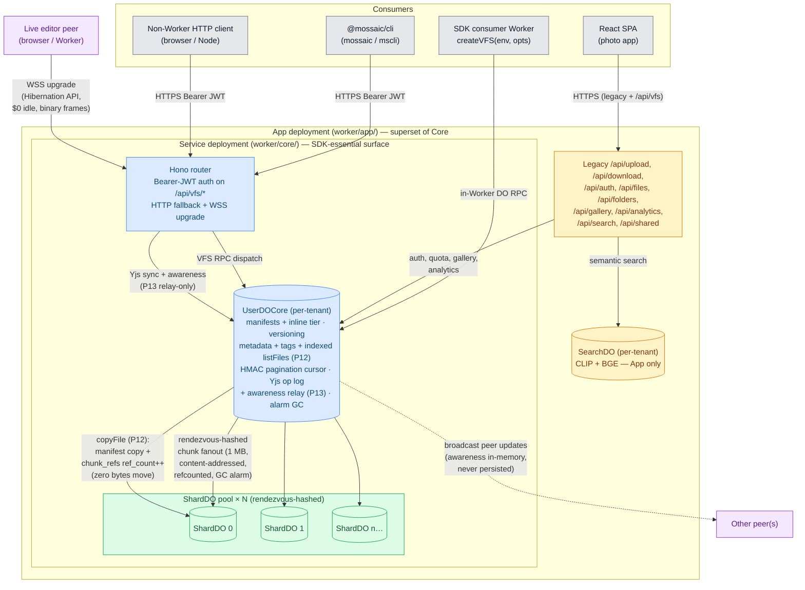

# Mossaic

**Horizontally-scalable chunked filesystem on Cloudflare Durable Objects.** &nbsp;·&nbsp; [**Live Demo →**](https://mossaic.ashishkumarsingh.com)

Mossaic exposes a Node `fs/promises`-shaped API over a content-addressed, deduplicating, parallel-chunked storage layer that runs entirely on the Cloudflare edge — no origin servers, no S3 buckets, no external databases. Use it for: photo libraries, ML datasets, build artifacts, isomorphic-git filesystem layer, container layers, attachments, **live collaborative documents** (per-file Yjs CRDT mode) — anything that needs real filesystem semantics with content-addressed dedup and parallel chunked streaming.

Files are split into 1 MB chunks, SHA-256 hashed, distributed across a dynamic pool of Durable Object shards via rendezvous hashing, and transferred in parallel. Identical bytes are stored once per tenant; tenants are isolated by construction; per-file CRDT mode runs over a Hibernation-API WebSocket at $0 idle cost; critical correctness invariants are formally proved in Lean 4 with Mathlib.

---

## Two products in one repo

| | What | Where |
|---|---|---|
| **Storage app** | A runnable photo library / file manager — drag-and-drop uploads, justified-grid gallery, lightbox, albums, analytics dashboard. Live at [mossaic.ashishkumarsingh.com](https://mossaic.ashishkumarsingh.com). | `src/` (React SPA) + `worker/` (Hono router + DOs) |
| **`@mossaic/sdk`** | An npm package any Cloudflare Worker can consume to embed Mossaic as a `fs/promises`-shaped VFS. Multi-tenant scoping, streaming, isomorphic-git compatible, per-file Yjs CRDT mode, typed errors, HTTP fallback for non-Worker consumers. | `sdk/` — see **[`sdk/README.md`](./sdk/README.md)** for the full DX walkthrough |
| **`@mossaic/cli`** | A Node 20+ CLI (`mossaic` / `mscli`) that drives a deployed Mossaic Service worker over HTTP/WSS. Mints VFS tokens locally, exposes every public SDK method as a verb, supports live Yjs editing over `wss://…/api/vfs/yjs/ws`. | `cli/` — see **[`cli/README.md`](./cli/README.md)** for the full command reference |

Both share the same Durable Object backend (`UserDO`, `ShardDO`, `SearchDO`) and the same chunking / placement primitives in `shared/`.

---

## `@mossaic/sdk` — fs/promises VFS for Cloudflare Workers

Mossaic's storage layer is packaged as an npm SDK (**[`@mossaic/sdk`](./sdk/README.md)**) that any Cloudflare Worker can consume to get a Node-`fs/promises`-shaped, isomorphic-git-compatible filesystem with content-addressed dedup, multi-tenancy, streaming, and typed errors.

### Quick start

```bash
pnpm add @mossaic/sdk
```

```ts
// src/index.ts
import { UserDO, ShardDO, createVFS } from "@mossaic/sdk";

// wrangler discovers DO classes from the Worker's main-module exports.
export { UserDO, ShardDO };

export interface Env {
  MOSSAIC_USER:  DurableObjectNamespace<UserDO>;
  MOSSAIC_SHARD: DurableObjectNamespace<ShardDO>;
}

export default {
  async fetch(req: Request, env: Env) {
    const vfs = createVFS(env, { tenant: "acme-corp" });
    await vfs.writeFile("/hello.txt", "world");
    return new Response(await vfs.readFile("/hello.txt", { encoding: "utf8" }));
  },
};
```

```jsonc
// wrangler.jsonc
{
  "name": "my-app",
  "main": "src/index.ts",
  "compatibility_date": "2026-03-01",
  "compatibility_flags": ["nodejs_compat"],

  "durable_objects": {
    "bindings": [
      { "name": "MOSSAIC_USER",  "class_name": "UserDO" },
      { "name": "MOSSAIC_SHARD", "class_name": "ShardDO" }
    ]
  },
  "migrations": [
    { "tag": "mossaic-v1", "new_sqlite_classes": ["UserDO", "ShardDO"] }
  ]
}
```

That's the entire integration. One outbound DO RPC per VFS call regardless of internal chunk fan-out; isomorphic-git plugs in directly via `vfs.promises === vfs`. Multi-tenant via `vfs:${ns}:${tenant}[:${sub}]` DO naming; per-tenant rate limits; HTTP fallback for non-Worker consumers; auto-batched `lstat` for git-style workloads.

For **live collaborative editing**, promote any file to Yjs-mode and open a CRDT handle:

```ts
import { openYDoc } from "@mossaic/sdk/yjs";

await vfs.setYjsMode("/notes/today.md", true);  // or vfs.chmod(p, { yjs: true })
const handle = await openYDoc(vfs, "/notes/today.md");
await handle.synced;                            // initial round-trip complete
handle.doc.getText("content").insert(0, "DRAFT — ");
await handle.close();
```

`yjs` and `y-protocols` are optional peer deps; importing from `@mossaic/sdk/yjs` is the opt-in. See the [Live editing with Yjs](#live-editing-with-yjs) section below, the **[integration guide](./docs/integration-guide.md)** for the canonical shape of every public API, and **[`sdk/README.md`](./sdk/README.md)** for the full DX walkthrough.

---

## `@mossaic/cli` — command-line tool against a deployed Mossaic worker

For operations and scripting workflows that don't run inside a Cloudflare Worker, `@mossaic/cli` (binary `mossaic`, alias `mscli`) speaks to a deployed Mossaic Service worker over HTTPS + WSS. It mints VFS-scoped JWTs locally (matching `worker/core/lib/auth.ts:signVFSToken`) using the operator's `JWT_SECRET`, and exposes every public SDK method as a CLI verb.

```bash
# 1) Configure the active profile (writes ~/.mossaic/config.json mode 0600).
mossaic auth setup \
  --endpoint https://mossaic-core.ashishkmr472.workers.dev \
  --secret "$JWT_SECRET" \
  --tenant team-acme

# 2) Verify.
mossaic auth whoami

# 3) Drive any VFS operation.
mossaic write /notes.md --text "# hello"
mossaic cat /notes.md --encoding utf8
mossaic find --tag draft --json
mossaic versions ls /notes.md

# 4) Live CRDT editing (Yjs over wss://).
mossaic yjs init /notes.md
echo "DRAFT — " | mossaic yjs edit /notes.md --flush --label "morning save"
```

The CLI is a sibling package at [`cli/`](./cli/) with its own README and its own ≥58 live E2E tests + ≥10 functional execa tests run against the deployed Service worker. See **[`cli/README.md`](./cli/README.md)** for the full command reference.

The Service worker exposes a public Yjs WebSocket upgrade route at `/api/vfs/yjs/ws` (Bearer-authenticated, forwards to `UserDOCore._fetchWebSocketUpgrade`). Without that route, Yjs would only be reachable from sibling Workers via `stub.fetch()`.

---

## Architecture

DO instance IDs derive from `vfs:${ns}:${tenant}[:${sub}]` — distinct triples land on distinct SQLite databases, so cross-tenant data is unreachable by construction.



Each tenant gets their own **UserDOCore** (manifests, metadata + tags + indexes, HMAC cursor, versioning, Yjs runtime + awareness relay) and a **dynamic pool of ShardDOs** that store the actual chunk data. Chunks are placed deterministically via rendezvous hashing — both client and server can independently compute which shard holds any chunk with zero coordination. The **Service deployment** ships UserDOCore + ShardDO + the Bearer-JWT-authed `/api/vfs/*` Hono router (HTTP fallback + WSS upgrade); the **App deployment** is a superset that adds the legacy photo-app routes, password auth, and SearchDO (CLIP + BGE semantic index).

**Three storage tiers**:
1. **Inline** (≤16 KB) — the file body lives in the UserDO row itself; no ShardDO fanout, no chunk RPC.
2. **Normal chunks** — 1 MB content-addressed blobs in ShardDOs, refcounted, deduplicated within the tenant, swept by a 30s-grace alarm GC.
3. **Yjs op-log + checkpoint chunks** — for files in CRDT mode, every Yjs update is a content-hashed op-log row and periodic compactions emit `Y.Doc` state snapshots. Both reuse the chunk fabric (rendezvous placement, refcount, GC).

**Two transports** out of UserDO:
- **DO RPC** — `vfs.*` calls dispatch over the `MOSSAIC_USER` binding; one outbound RPC per VFS call regardless of internal chunk fanout.
- **WebSocket upgrade** — live Yjs sessions speak the standard sync protocol over Cloudflare's [Hibernation API](https://developers.cloudflare.com/durable-objects/api/websockets/#hibernation-api). Idle connections cost **$0** — workerd evicts the DO between frames and rehydrates per message; per-socket state survives via `serializeAttachment`.

---

## Live editing with Yjs

Mossaic ships **per-file CRDT mode** (Phase 10). Any file can be promoted to "yjs-mode" with a one-line `setYjsMode` call; from then on, every `writeFile` becomes a CRDT transaction, `readFile` materialises the current state, and any number of clients can co-edit live over a WebSocket. CRDT and plain files coexist in the same filesystem, the same tenant, the same directory.

**Opt-in via mode bit.** A file is plain until you toggle it. Two equivalent forms:

```ts
await vfs.setYjsMode("/notes/today.md", true);
// or
await vfs.chmod("/notes/today.md", { yjs: true });
```

Stat surfaces the bit on `mode` (`VFS_MODE_YJS_BIT === 0o4000`).

**`openYDoc` API.** From `@mossaic/sdk/yjs` (a subpath export so the main bundle stays Yjs-free):

```ts
import { openYDoc } from "@mossaic/sdk/yjs";

const handle = await openYDoc(vfs, "/notes/today.md");
await handle.synced;                                       // initial round-trip complete
handle.doc.getText("content").insert(0, "DRAFT — ");      // standard Y.Doc mutations
handle.doc.on("update", (update, origin) => { /* … */ });  // Y.Doc events
handle.awareness.setLocalState({ name: "alice", cursor: 0 });
handle.awareness.on("change", () => render(handle.awareness.getStates()));
await handle.close();
```

The `YDocHandle` shape: `{ doc: Y.Doc; awareness: Awareness; synced: Promise<void>; close(): Promise<void>; flush({ label? }): Promise<{ versionId, checkpointSeq }>; onClose(cb); onError(cb) }`. Note: there is no `handle.on("sync")` or `handle.on("update")` — those events live on the underlying `doc` and `awareness` instances, not on the handle itself.

`yjs` and `y-protocols` are **optional peer dependencies** — bring your own versions (tested against `yjs >=13.6.0`, `y-protocols >=1.0.6`).

**Wire protocol & transport.** The standard Yjs sync protocol (`sync_step_1` / `sync_step_2` / `update`) plus a fourth tag for awareness, transported as **binary WebSocket frames** end-to-end — no JSON, no base64, no envelope overhead. The WebSocket terminates inside the tenant's UserDO via Cloudflare's Hibernation API: idle connections cost **$0**, per-socket state survives eviction via `serializeAttachment`. Awareness frames are relayed by the server but **never persisted** — the per-pathId Awareness instance lives only in DO memory and resets on eviction; clients re-broadcast their state on reconnect (standard y-websocket semantics).

**Storage model.** Every Yjs update lands in a `yjs_oplog` row keyed by `(path_id, seq)`. The update bytes are content-hashed and pushed into Mossaic's existing chunk fabric — same rendezvous-hashed shard placement, same refcounted GC, same per-tenant isolation that ordinary blobs use. Periodic **compaction** (every N ops or T minutes) emits a `Y.Doc` state snapshot as a checkpoint chunk and reaps the prior op-log chunks via the standard alarm sweeper.

**Versioning interop.** When both versioning and yjs-mode are on, **compaction snapshots** create Mossaic version rows — you get a version row per checkpoint, not per keystroke. Live ops between snapshots are NOT versioned: the Yjs op log IS the live history.

**isomorphic-git interop.** Yjs-mode files appear as **normal files** to non-collab tools — `readFile` returns the materialised content, so `git add` / `git commit` / `git diff` see it as bytes like any other file. A `writeFile` issued by Git tooling on a yjs-mode file becomes a CRDT replacement transaction, which means concurrent live editors see the Git write as a merge rather than a clobber. **Caveat**: blob hashes change every transaction (the underlying chunks are Yjs updates, not the file content), so don't expect Git-friendly diffs against earlier commits — promote a file when you want CRDT semantics, not on the source you want Git to track.

**Demoting back to plain mode is rejected** (`EINVAL`) — it would silently lose CRDT history. To get a plain copy, `readFile` and `writeFile` to a different path.

> **Why this matters.** `fs/promises` + content-addressed dedup + per-file live CRDT collab in one filesystem doesn't exist anywhere else in the Cloudflare ecosystem. R2 is bulk object storage, no filesystem semantics; Artifacts is Git-shaped, not fs-shaped, no live collab; bring-your-own Yjs servers don't share storage with your blobs and don't dedup. Use Mossaic when you want all three.

The 10 Yjs invariants (schema migration, promotion semantics, write/read round-trip, stat bit, unlink purge, compaction, tenant isolation, igit interop, two-client live round-trip) are pinned by `tests/integration/yjs.test.ts` (218/218 tests passing). Lean 4 formalization of those invariants is future work — see [Formal verification](#formal-verification) for what's currently machine-checked.

For the full DX (`chmod` overload, `setYjsMode` on freshly-created files, error codes, peer-dep matrix, more examples), see the **[Live editing with Yjs section in `sdk/README.md`](./sdk/README.md#live-editing-with-yjs-per-file-crdt-mode)**.

---

## Features

**Storage core (used by both products)**

- **`fs/promises` surface** — readFile / writeFile / stat / readdir / mkdir / rmdir / unlink / rename / chmod / symlink / readlink / lstat / exists, plus streaming via `createReadStream` / `createWriteStream` and batched `readManyStat` for git-style workloads
- **Multi-tenant by construction** — DO instances named `vfs:${ns}:${tenant}[:${sub}]`; cross-tenant data is unreachable, cross-tenant chunk dedup is impossible
- **Content-addressed deduplication** — every chunk is SHA-256 hashed; duplicate chunks within a tenant are reference-counted, never stored twice
- **Inline tier** — files ≤16 KB skip chunking entirely and inline into the UserDO row; everything larger flows through the chunked path
- **Atomic writes** — `writeFile` and `createWriteStream` use temp-id-then-rename two-phase commit; partial writes are never visible to readers
- **Refcounted GC** — alarm-driven sweeper hard-deletes chunks whose refcount has reached zero, with a 30s grace window for resurrection
- **File-level versioning** (opt-in) — every overwrite creates an immutable `version_id`; `listVersions` / `restoreVersion` / `dropVersions` retention policies; tombstone-on-`unlink`; cross-version dedup keeps storage bounded
- **Per-file Yjs CRDT mode** (opt-in) — promote any file to live-collab via `setYjsMode` or `chmod(p, { yjs: true })`; clients co-edit over a Hibernation-API WebSocket ($0 idle billing) speaking the standard binary Yjs sync protocol; periodic compaction snapshots the `Y.Doc` and reaps the op log; isomorphic-git sees yjs-mode files as plain bytes; `openYDoc(vfs, path) → YDocHandle` from the `@mossaic/sdk/yjs` subpath export (yjs is an optional peer dep)
- **Chunked parallel uploads & downloads** — 1 MB chunks transferred with up to 6 concurrent streams, exponential-backoff retry, real-time throughput/ETA tracking
- **Rendezvous hashing placement** — deterministic, coordination-free chunk-to-shard mapping via MurmurHash3; adding shards causes minimal redistribution
- **Dynamic shard pool** — starts at 32 shards per tenant, grows by 1 shard per 5 GB stored
- **isomorphic-git compatible** — `vfs.promises === vfs`; `git.init` / `add` / `commit` / `log` round-trip cleanly; opt-in batched `lstat` coalesces `git status` bursts into one RPC
- **Formal Lean 4 proofs** — refcount well-formedness, tenant isolation, GC safety, versioning monotonicity (V3) machine-checked; see [`lean/`](./lean/)
- **Typed errors** — `ENOENT`, `EEXIST`, `EISDIR`, `ENOTDIR`, `EFBIG`, `ELOOP`, `EBUSY`, `EINVAL`, `EACCES`, `EROFS`, `ENOTEMPTY`, `EAGAIN`, plus `MossaicUnavailableError` for transport-level soft-fail

**Storage app UI** (the [live demo](https://mossaic.ashishkumarsingh.com))

- **JWT authentication** — PBKDF2-hashed passwords (100k iterations), HS256 JWTs via `jose`, 30-day sessions
- **File manager** — drag-and-drop uploads, nested folder hierarchy, breadcrumb navigation, search-param-driven routing
- **Photo gallery** — justified grid layout (Google Photos-style), full-screen lightbox with zoom/pan/swipe, keyboard navigation, filmstrip scrubber
- **Albums & sharing** — client-side album management, public shared album links via base64-encoded tokens
- **Analytics dashboard** — storage quota, file status breakdown, MIME distribution, per-shard chunk/dedup stats, recent uploads
- **Dark & light themes** — CSS custom property theming with Tailwind v4, persisted to localStorage

---

## How It Works

### Chunking

Every file is split into fixed **1 MB (1,048,576 byte)** chunks. The last chunk may be smaller. Files under 1 MB are a single chunk. This is computed identically on both client and server via `shared/chunking.ts`.

### Placement via Rendezvous Hashing

For each chunk, Mossaic computes a [rendezvous hash](https://en.wikipedia.org/wiki/Rendezvous_hashing) (highest random weight) score against every shard in the user's pool:

```
score = murmurhash3("{fileId}:{chunkIndex}:shard:{userId}:{shardIndex}")
```

The shard with the **highest score** wins. This is:
- **Deterministic** — the same inputs always produce the same placement, no coordination needed
- **Minimal disruption** — when the pool grows, only ~1/n chunks need to move
- **Uniform** — MurmurHash3 distributes chunks evenly across shards

The placement logic lives in `shared/placement.ts` and is imported by both the frontend and the worker.

### Parallel Transfer

**Upload flow:**
1. `POST /api/upload/init` — server creates a file record, returns chunk layout and pool size
2. Client slices the file, SHA-256 hashes each chunk, and uploads up to 6 chunks concurrently via `PUT /api/upload/chunk/:fileId/:chunkIndex`
3. The worker computes the target shard via rendezvous hashing and forwards the chunk to the correct ShardDO
4. ShardDO performs content-addressed dedup: if the hash already exists, it increments ref_count (zero bytes stored); otherwise it inserts the BLOB
5. `POST /api/upload/complete/:fileId` — client sends the file hash (SHA-256 of all chunk hashes), server marks the file complete

**Download flow:**
1. `GET /api/download/manifest/:fileId` — returns the full chunk list with shard locations
2. Client downloads up to 6 chunks concurrently via `GET /api/download/chunk/:fileId/:chunkIndex`
3. Chunks are reassembled in order and delivered as a browser download

---

## Tech Stack

| Layer | Technology |
|---|---|
| **Runtime** | [Cloudflare Workers](https://workers.cloudflare.com/) |
| **State** | [Durable Objects](https://developers.cloudflare.com/durable-objects/) with SQLite storage |
| **Routing** | [Hono](https://hono.dev/) |
| **Auth** | [jose](https://github.com/panva/jose) (JWT), PBKDF2-SHA-256 (passwords) |
| **Frontend** | [React 19](https://react.dev/) + [React Router v7](https://reactrouter.com/) |
| **Build** | [Vite](https://vite.dev/) + [@cloudflare/vite-plugin](https://github.com/cloudflare/workers-sdk) |
| **Styling** | [Tailwind CSS v4](https://tailwindcss.com/) + [Radix UI](https://www.radix-ui.com/) primitives |
| **Animation** | [Framer Motion](https://www.framer.com/motion/) |
| **Icons** | [Lucide React](https://lucide.dev/) |
| **Package manager** | [pnpm](https://pnpm.io/) |

---

## Project Structure

```
mossaic/
├── shared/                     # Shared library (imported by frontend + worker)
│   ├── types.ts                #   All TypeScript types and interfaces
│   ├── constants.ts            #   Chunk size, pool config, limits, concurrency
│   ├── chunking.ts             #   Fixed 1 MB chunk splitting logic
│   ├── placement.ts            #   Rendezvous hashing (chunk → shard mapping)
│   ├── hash.ts                 #   MurmurHash3 (32-bit, for placement)
│   └── crypto.ts               #   SHA-256 chunk/file hashing (Web Crypto API)
│
├── worker/                     # Cloudflare Worker backend
│   ├── index.ts                #   Hono app, CORS, DO re-exports, SPA fallback
│   ├── routes/
│   │   ├── auth.ts             #     POST /api/auth/signup, /login
│   │   ├── upload.ts           #     Upload init, chunk PUT, complete
│   │   ├── download.ts         #     Manifest GET, chunk streaming
│   │   ├── files.ts            #     File listing and deletion
│   │   ├── folders.ts          #     Folder CRUD
│   │   ├── analytics.ts        #     GET /api/analytics/overview
│   │   ├── gallery.ts          #     Photo listing, image/thumbnail serving
│   │   └── shared.ts           #     Public shared album endpoints
│   ├── objects/
│   │   ├── user/
│   │   │   ├── user-do.ts      #     UserDO class (auth, files, folders, quota)
│   │   │   ├── auth.ts         #     Signup/login handlers
│   │   │   ├── files.ts        #     File CRUD, manifest, chunk recording
│   │   │   ├── folders.ts      #     Folder CRUD, breadcrumb path
│   │   │   └── quota.ts        #     Storage quota, dynamic pool sizing
│   │   └── shard/
│   │       └── shard-do.ts     #     ShardDO class (chunk storage, dedup, refs)
│   └── lib/
│       ├── auth.ts             #     JWT sign/verify, auth middleware
│       ├── crypto.ts           #     PBKDF2 password hashing
│       └── utils.ts            #     ID generation, DO name helpers
│
├── src/                        # React SPA frontend
│   ├── app.tsx                 #   Root component, routing, providers
│   ├── main.tsx                #   Vite entry point
│   ├── index.css               #   Tailwind v4 theme tokens (dark/light)
│   ├── lib/
│   │   ├── api.ts              #     API client singleton
│   │   ├── auth.tsx            #     Auth context + useAuth hook
│   │   ├── theme.tsx           #     Dark/light theme provider
│   │   └── utils.ts            #     formatBytes, formatDate, cn(), etc.
│   ├── hooks/
│   │   ├── use-upload.ts       #     Parallel chunked upload engine
│   │   ├── use-download.ts     #     Parallel chunked download engine
│   │   ├── use-files.ts        #     File/folder listing hook
│   │   ├── use-gallery.ts      #     Photo gallery with date grouping
│   │   ├── use-albums.ts       #     Album CRUD (localStorage-backed)
│   │   ├── use-analytics.ts    #     Analytics data fetcher
│   │   └── use-image-loader.ts #     Auth-aware blob URL image loading
│   ├── pages/
│   │   ├── landing.tsx         #     Marketing landing page
│   │   ├── files.tsx           #     File manager page
│   │   └── analytics.tsx       #     Analytics dashboard
│   └── components/
│       ├── auth/               #     Login/signup form
│       ├── layout/             #     Sidebar, app shell
│       ├── files/              #     File rows, folder rows, breadcrumbs
│       ├── upload/             #     Drag-and-drop zone, transfer panel
│       ├── gallery/            #     Justified grid, thumbnails, lightbox
│       └── ui/                 #     Radix-based design system primitives
│
├── wrangler.jsonc              # Cloudflare config (DO bindings, migrations)
├── vite.config.ts              # Vite + Tailwind + Cloudflare plugin
├── package.json                # Dependencies and scripts
└── tsconfig.json               # TypeScript project references
```

---

## Getting Started

### Prerequisites

- [Node.js](https://nodejs.org/) (v18+)
- [pnpm](https://pnpm.io/)

### Install

```bash
pnpm install
```

### Develop

```bash
pnpm dev
```

This starts the Vite dev server with the Cloudflare plugin on `http://localhost:5174`. Durable Objects run locally via Miniflare — no Cloudflare account needed for development.

### Build

```bash
pnpm build
```

### Deploy

```bash
pnpm deploy
```

Builds the SPA and deploys the worker + assets to Cloudflare.

---

## Roadmap

- **Semantic search** — provider-agnostic vector search over stored files. Planned backend options:
  - [Cloudflare Vectorize](https://developers.cloudflare.com/vectorize/) + [Workers AI](https://developers.cloudflare.com/workers-ai/) for edge-native inference
  - [Ollama](https://ollama.ai/) for self-hosted local models
  - Pluggable local vector DB for offline/dev workflows
- **Shared albums enhancement** — server-side album storage, granular permissions, expiring share links
- **Resumable uploads** — persist upload state to recover from interruptions
- **Chunk-level integrity verification** — client-side hash verification on download
- **Storage tiering** — hot/cold chunk migration based on access patterns

---

## Build & Deploy

### Prerequisites

- [Node.js](https://nodejs.org/) v20+
- [pnpm](https://pnpm.io/)
- A [Cloudflare account](https://dash.cloudflare.com/sign-up) (free tier works)
- A custom domain on the same Cloudflare account, if you intend to serve from one (otherwise the default `*.workers.dev` subdomain is used)

### Local development

```bash
pnpm install
pnpm dev
```

Vite + the Cloudflare plugin run the worker, Durable Objects (via Miniflare), and the SPA together — no Cloudflare account needed for local work.

### Production build

```bash
pnpm build
```

Outputs the SPA assets and worker bundle that `wrangler deploy` will publish.

### Deploy to Cloudflare

```bash
npx wrangler login
```

Then open [`wrangler.jsonc`](wrangler.jsonc) and set:

- `account_id` — your Cloudflare account ID (visible in the dashboard sidebar)
- `routes` — the hostname(s) you want to serve from, e.g. `[{ "pattern": "mossaic.example.com", "custom_domain": true }]`. Omit `routes` to deploy to the default `*.workers.dev` subdomain.

Then ship it:

```bash
npx wrangler deploy
```

The first deploy provisions the Durable Object namespaces and applies the migrations declared in `wrangler.jsonc`.

---

## Formal verification

Critical correctness invariants are formally proved in **Lean 4 with Mathlib** — **zero `sorry`, zero project `axiom`** (only Lean's three kernel axioms `propext` / `Classical.choice` / `Quot.sound` are transitively in scope, via Mathlib). Currently machine-checked:

- **I1 — Refcount validity** including the full numerical equality `refCount = countP (·.hash = c.hash) refs` over all reachable shard states (was axiom-conditional in v1; Mathlib's `List.countP` lemmas discharge it directly).
- **I2 — Atomic-write linearizability** for the temp-id-then-rename two-phase `writeFile` commit, including no-torn-state during in-flight writes.
- **I3 — Tenant isolation** — `vfsUserDOName` and `vfsShardDOName` are injective on valid scopes; cross-tenant DO-instance collision is impossible.
- **I4 — Versioning sortedness & monotonicity** — `listVersions` is `Pairwise (mtimeMs ≥)`; `insertVersion mtime ⇒ maxMtime ≥ mtime`.
- **I5 — GC safety** — the alarm sweeper only deletes chunks with `refCount = 0`, preserves `validState`, and clears `deletedAt` on resurrected chunks. Now **unconditional** (no axiom).

```bash
pnpm lean:build
```

See **[`lean/README.md`](./lean/README.md)** for theorem names, the TS↔Lean cross-reference protocol (`@lean-invariant` JSDoc tags pinned by CI), and documented limitations (SHA-256 collision-resistance, SQLite UNIQUE-INDEX semantics, and wall-clock alarm timeliness are out of scope).

The **10 Yjs invariants** added in Phase 10 (schema migration, promotion semantics, write/read round-trip, stat bit, unlink purge, compaction, tenant isolation, igit interop, two-client live round-trip) are currently **test-pinned** by `tests/integration/yjs.test.ts` (218/218 tests passing). Lean formalization of those invariants is future work.

---

## License

[MIT](LICENSE)
