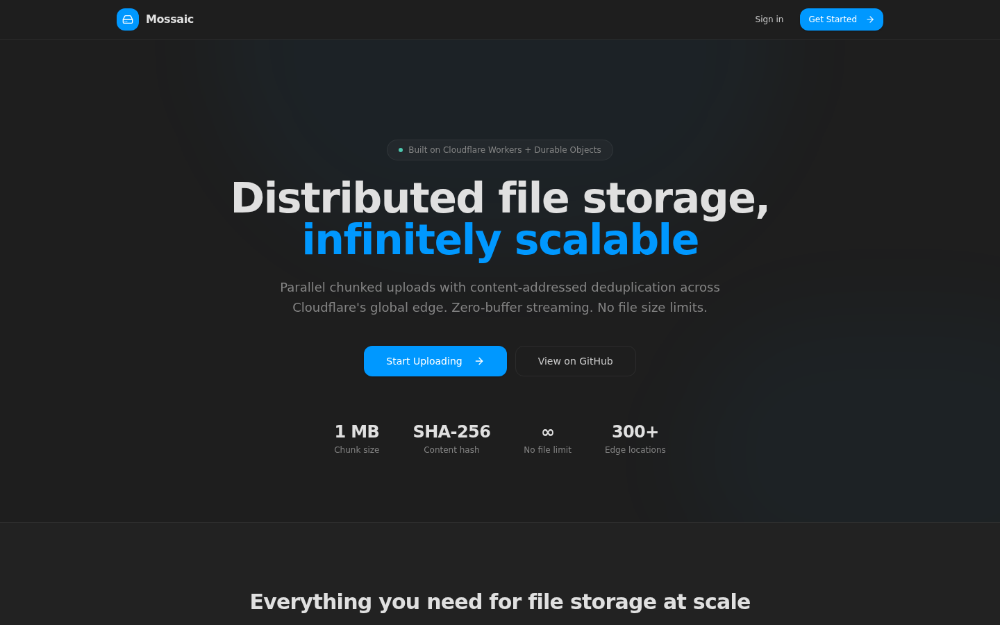
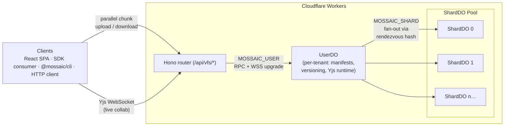
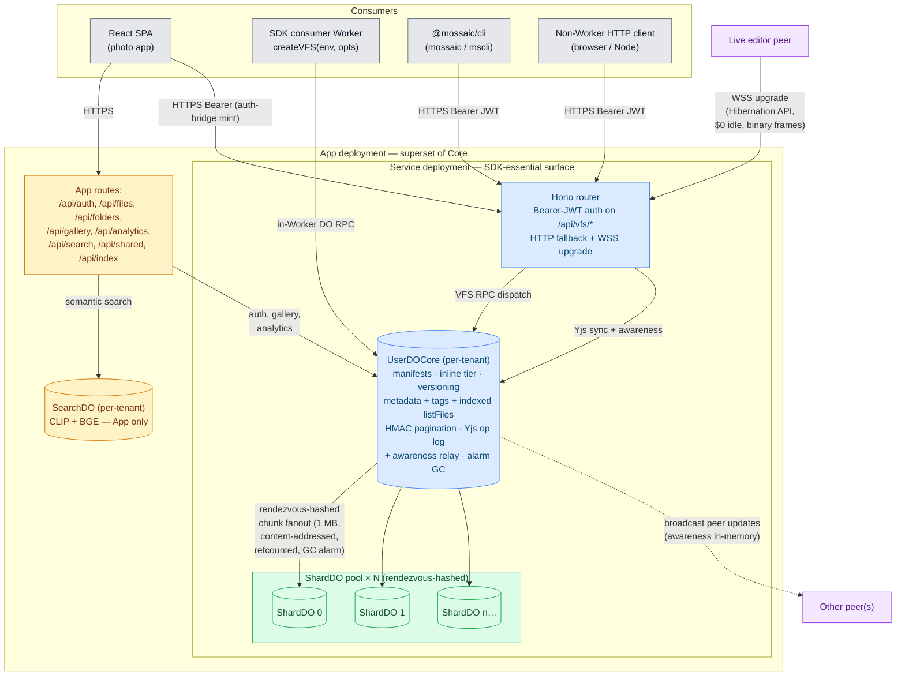

<div align="center">
  

  <p>
    <strong>A Node <code>fs/promises</code> filesystem on Cloudflare Durable Objects.</strong>
  </p>

  <p>
    <a href="https://mossaic.ashishkumarsingh.com">Live demo</a> ·
    <a href="./sdk/README.md"><code>@mossaic/sdk</code></a> ·
    <a href="./cli/README.md"><code>@mossaic/cli</code></a> ·
    <a href="./docs/integration-guide.md">Integration guide</a> ·
    <a href="./lean/">Lean proofs</a>
  </p>

  
</div>

---

## What is Mossaic?

A horizontally-scalable, content-addressed filesystem that runs entirely on Cloudflare's edge — no origin servers, no S3, no external databases. Files are split into 1 MB chunks, SHA-256 hashed, distributed across a dynamic pool of Durable Object shards via rendezvous hashing, and transferred in parallel.

Use it for photo libraries, ML datasets, build artifacts, isomorphic-git filesystem layers, attachments, container layers, or **live collaborative documents** (per-file Yjs CRDT mode at $0 idle billing). Critical correctness invariants are formally proved in **Lean 4 with Mathlib**.

The repo ships **two products**: a runnable photo-library SPA and a reusable npm SDK. They share the same Durable-Object backend, the same chunking and placement primitives, and the same canonical `/api/vfs/*` HTTP surface.

---

## Quick start — SDK

```bash
pnpm add @mossaic/sdk
```

```ts
import { UserDO, ShardDO, createVFS } from "@mossaic/sdk";

// wrangler discovers DO classes from the Worker's main-module exports.
export { UserDO, ShardDO };

export interface Env {
  MOSSAIC_USER:  DurableObjectNamespace<UserDO>;
  MOSSAIC_SHARD: DurableObjectNamespace<ShardDO>;
}

export default {
  async fetch(_req: Request, env: Env) {
    const vfs = createVFS(env, { tenant: "acme-corp" });
    await vfs.writeFile("/hello.txt", "world");
    return new Response(await vfs.readFile("/hello.txt", { encoding: "utf8" }));
  },
};
```

That's the entire integration. Multi-tenant via `vfs:${ns}:${tenant}[:${sub}]` DO naming, one outbound DO RPC per VFS call, isomorphic-git plugs in directly via `vfs.promises === vfs`. See **[`sdk/README.md`](./sdk/README.md)** for the full surface — streaming, encryption, versioning, Yjs CRDT mode, HTTP fallback for non-Worker consumers.

## Quick start — CLI

```bash
pnpm add -g @mossaic/cli
mossaic auth setup --endpoint https://my-mossaic.workers.dev --secret "$JWT_SECRET" --tenant team-acme
mossaic write /notes.md --text "# hello"
mossaic cat /notes.md --encoding utf8
mossaic find --tag draft --json
```

See **[`cli/README.md`](./cli/README.md)** for the full command reference.

---

## Architecture



Each tenant gets a dedicated **UserDO** (manifests, metadata + tags + indexed `listFiles`, HMAC pagination cursors, versioning, Yjs op-log + awareness relay) and a **dynamic pool of ShardDOs** that hold the chunk data. Chunks are placed deterministically via [rendezvous hashing](https://en.wikipedia.org/wiki/Rendezvous_hashing) — both client and server independently compute which shard holds any chunk with zero coordination.

The pool starts at **32 ShardDOs per tenant** and grows by **+1 ShardDO per 5 GB stored**, so a tenant accumulating data widens its rendezvous space organically — `placeChunk` for new files routes ~1/(N+1) of new chunks to the freshly-added shard. Existing chunks stay pinned to their original shard via the `file_chunks.shard_index` recorded at write time, so growth never reshuffles already-stored data. Pool size is high-water-marked: deletes tick `quota.storage_used` down but never shrink the pool, because shrinking would orphan chunks pinned to the dropped shard indices. Wiring lives in `worker/core/objects/user/vfs/helpers.ts:376` (`recordWriteUsage`); pinned by `tests/integration/pool-growth.test.ts`.

The same Hono router serves SDK consumers, the CLI, and the SPA via canonical `/api/vfs/*`. The App deployment adds a thin auth/photo-gallery surface on top; the Service deployment ships only the SDK-essential routes.



**Three storage tiers**: inline (≤16 KB; embedded in the UserDO row), normal chunks (1 MB content-addressed blobs in ShardDOs, refcounted, swept by a 30s-grace alarm GC), and Yjs op-log + checkpoint chunks (live-collab files; updates and snapshots reuse the chunk fabric). **Two transports**: typed DO RPC for everything except live editing, which speaks the standard Yjs binary protocol over a Hibernation-API WebSocket — idle connections cost $0.

---

## Features

- `fs/promises` surface: `readFile` · `writeFile` · `stat` · `readdir` · `mkdir` · `rmdir` · `unlink` · `rename` · `chmod` · `symlink` · `readlink` · `lstat` · plus `createReadStream` / `createWriteStream` and batched `readManyStat`.
- **Multi-tenant by construction** — DO instance names `vfs:${ns}:${tenant}[:${sub}]`; cross-tenant collision impossible.
- **Content-addressed dedup** — SHA-256 chunk hashes, refcounted within tenant, never stored twice.
- **Atomic writes** — temp-id-then-rename two-phase commit; partial writes never visible to readers.
- **File-level versioning** (opt-in) — `listVersions` / `restoreVersion` / `dropVersions`; tombstone-on-`unlink`; cross-version dedup.
- **Per-file Yjs CRDT mode** (opt-in) — promote any file with `setYjsMode`; standard binary sync protocol over a Hibernation-API WebSocket; isomorphic-git sees yjs files as plain bytes.
- **Universal preview pipeline** — `vfs.readPreview()` returns rendered bytes for any file (Cloudflare Images, code as SVG, audio waveform, icon-card fallback); standard variants pre-generated at upload-finalize.
- **Opt-in end-to-end encryption** — AES-GCM-256 per chunk; `convergent` (preserves dedup) or `random` mode; server never sees plaintext.
- **Parallel transfer** — `parallelUpload` / `parallelDownload` with adaptive concurrency, content-addressed dedup, exponential-backoff retry.
- **isomorphic-git compatible** — `vfs.promises === vfs`; opt-in batched `lstat` coalesces `git status` bursts into one RPC.
- **Typed errors** — `ENOENT`, `EEXIST`, `EISDIR`, `ENOTDIR`, `EFBIG`, `ELOOP`, `EBUSY`, `EINVAL`, `EACCES`, `EROFS`, `ENOTEMPTY`, `EAGAIN`, `EBADF`, `ENOTSUP` plus `MossaicUnavailableError`.

---

## Formal verification

Critical correctness invariants are machine-checked in **Lean 4 with Mathlib** — **zero `sorry`, zero project axiom**:

- **I1** — refcount well-formedness over all reachable shard states.
- **I2** — atomic-write linearizability (the temp-id-then-rename commit).
- **I3** — tenant isolation: `vfsUserDOName` and `vfsShardDOName` injective on valid scopes.
- **I4** — versioning sortedness & monotonicity.
- **I5** — GC safety: alarm sweeper only deletes `refCount = 0` chunks.

```bash
pnpm lean:build
```

See **[`lean/`](./lean/)** for theorem names, the TS↔Lean cross-reference protocol, and documented limitations.

---

## Develop

```bash
pnpm install
pnpm dev      # SPA + worker + DOs via Miniflare on http://localhost:5174
pnpm test     # 534 worker + 46 cli + 96 live E2E + 12 browser E2E
```

Deploy with `npx wrangler deploy` (after `wrangler login` and setting `account_id` + `routes` in `wrangler.jsonc`). The first deploy provisions the Durable Object namespaces and applies the migrations.

---

## License

[MIT](./LICENSE)
